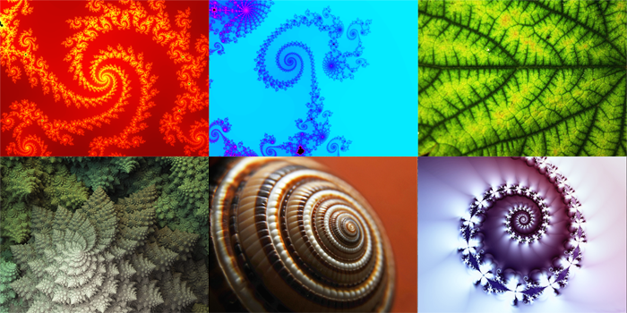

Title: Fraktály - krása matematiky
Date: 2012-05-20 17:32
Author: tastyfish
Category: Articles
Tags: math
Lang: cs
Status: published



Je škoda, že osnovy matematiky pro střední školy nezahrnují
alespoň letmo fraktály, neboť by matematika určitě zaujala mnohem víc
lidí než za současné situace. Bohužel averze většiny lidí k matematice
přetrvává a pramení ze zažité představy tohoto oboru jako množiny
nezajímavých vzorců, které se učí ve školách. Tímto článkem bych chtěl
čistě neformálně a velmi stručně nastínit koncept fraktálů, jednoho z
nejkrásnějších objevů matematiky.

Co jsou fraktály?
-----------------

Fraktál je neformálně řečeno velmi složitý geometrický objekt, který se
donekonečna opakuje v sobě samém. Můžeme si jej libovolně přibližovat a
stále budeme objevovat stejné nebo podobné tvary. Zajímavé na fraktálech
je, že je má velice v oblibě příroda a důvod je nejspíš především jeden:
ačkoliv se jedná o nesmírně složité objekty, dají se popsat velmi
jednoduše, nejčastěji jedním jednoduchým vzorcem nebo jen pár
triviálními pravidly! V DNA organismu tedy stačí zakódovat jednoduchou
sekvenci, aby vznikl například celý složitý strom, jehož větve se samy
podobají menším stromům, nebo třeba náš cévní systém. Fraktály v přírodě
ale nalezneme i mezi neživými věcmi, jako jsou například sněhové vločky.

Vločka (Kochova křivka)
-----------------------

Když už jsme u vloček, uvedu příklad jednoduchého fraktálu na začátek. K
jeho pochopení není třeba umět počítat s čísly a už vůbec ne vědět něco
víc o matematice. Navzdory tomuto faktu se jedná o nádherný a složitý
objekt. Naše vločka se skládá ze čtyř částí, z nichž každou sestrojíme
takto:

1.  nakreslíme úsečku
2.  veprostřed ji umažeme a uděláme „stříšku“, tento krok opakujeme do
    nekonečna pro každou nově vzniklou úsečku (v praxi dokud nás to
    nepřestane bavit {{m.e('^^')}})

Myslím, že výsledek je více než působivý a proto snad stojí za to číst
dál {{m.e(':)')}}

Mandelbrotova množina (trochu silnější káva)
--------------------------------------------

Když jsem se poprvé o fraktálech dozvěděl někdy na střední škole, jako
první jsem se setkal s Mandelbrotovou množinou, protože je to asi
nejčastěji uváděný příklad fraktálu. Není divu, jde totiž o jeden z
nejkrásnějších fraktálů vůbec, obzvlášť když si přiblížíte některé jeho
části. Můžete si to ostatně sami zkusit ve [webové aplikaci](http://www.fractalposter.com/fractal_generator.php).

Pochopení popisu tohoto fraktálu už ale není zadarmo a vyžaduje trochu
rozumět komplexním číslům, kterým se slušní lidé často vyhýbají (já
především proto, že mi připomínají elektroniku a teorii obvodů \^\^).
Tady ale nejsme na zkoušce z matematiky, nýbrž se chceme dozvědět něco o
tomto krásném díle přírody, tak se na to pojďme s odvahou podívat.
Zkusím to podat, jak nejjednodušeji to jde.

Především se nabízí otázka, co to Mandelbrotova množina přesně je. Je to
množina komplexních čísel. Komplexní číslo, jak si snad většina lidí
vybaví, se skládá ze dvou složek a proto se dá interpretovat jako bod ve
dvourozměrném prostoru (dvě složky odpovídají dvěma souřadnicím x a y).
Celý obrazec Mandelbrotovy množiny by tedy měl být jenom černobílý (nebo
spíše dvoubarevný) - černé body do množiny patří, bíle nikoliv. Bodů v
množině je samozřejmě nekonečně (a nespočetně) mnoho. Kde se ale berou
ty pěkné barvičky na obrázku? To se dozvíme za chvíli.

Vycházejme tedy z faktu, že každý bod ve dvourozměrné (komplexní) rovině
buď do množiny patří nebo ne. Co nám ale řekne, které body jsou v
množině a které mimo? Je to jednoduchá matematická posloupnost:

  
Z~0~ = 0, Z~n+1~ = Z~n~^2^ + c  

Vzorce můžou někoho vystrašit, ale pochopení těchto dvou jednoduchých
rovnic nám udělá hned ve všem naprosto jasno, což si myslím, že za cenu
malého zamyšlení je více než dobrá odměna. Symbol *c* v zápisu je
komplexní číslo, které ověřujeme, tedy bod, u kterého zjišťujeme, zda
patří či nepatří do množiny. Z~n~ znamená ntý člen této posloupnosti.
Rovnice tedy říkají, že prvním členem posloupnosti je 0 a každý další
člen dostaneme tak, že ten, který zrovna máme, umocníme na druhou a
přičteme k němu naše ověřované číslo (bod) *c*. Toto opakujeme
(teoreticky) do nekonečna. Samotné rozhodnutí o náležitosti čísla (bodu)
*c* do množiny závisí na tom, jestli nám jako poslední člen vyjde
nekonečno, v kterémžto případě bod do množiny nepatří, či nikoliv, což
je kladný případ náležitosti do množiny. Dá se dokázat, že celá
Mandelbrotova množina leží uprostřed kružnice o poloměru 2 a středem v
počátku souřadnic, proto nám stačí brát body z této oblasti, dosazovat
je do rovnice za číslo *c* a podle toho kreslit množinu.

Zbývá ale vysvětlit, jak máme body ověřovat, když pro každý je potřeba
udělat nekonečný počet kroků výpočtu za účelem zjištění posledního členu
posloupnosti. To samozřejmě v praxi není možné a proto počítač, který
provádí výpočet pro každý bod, udělá jenom předem stanovený počet kroků,
tzv. iterací. Pokud po daném počtu iterací nevyjde nekonečno,
předpokládá se náležitost bodu do množiny, což je sice pravděpodobné ale
nikoliv jisté. Čím více iterací počítač dělá, tím je větší šance, že
správně určí náležitost bodu do množiny, a to je právě to, odkud se
berou ty pěkně barevné obrázky. V těch jsou totiž různými barvami
zakreslené různé výsledky výpočtu množiny s různou přesností, tzn. s
různě velkým počtem iterací. Začne se tedy s počtem iterací 1 a světlou
barvou, postupně se iterace zvyšují a barva např. ztmavuje, což vytvoří
krásný přechod v obrázku.

Tak a to je všechno na úvod k Mandelbrotově množině a vůbec k fraktálům
{{m.e(':)')}} Okolo fraktálů samozřejmě existuje spousta složité matematiky a
všechno sahá mnohem hlouběji než jenom k vizuálně pěkným věcem, ale to
všechno ostatní s radostí přenechávám studentům matfyzu. Doufám, že
tento článek matematice alespoň trochu pomůže napravit její pověst
{{m.e(':)')}}
