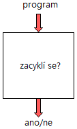
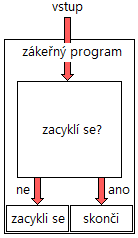
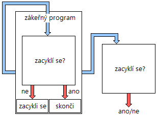

Title: Nerozhodnutelnost versus lidský mozek
Date: 2014-08-02 12:46
Author: tastyfish
Category: Articles
Slug: nerozhodnutelnost
Lang: cs
Status: published

V tomto článku bych chtěl uvést pár myšlenek, kterými jsem se
nedávno krátce zabýval. Teoretickou informatiku jsme ve škole doposud
nebrali a tudíž na ni nemám zatím špatný názor. Proto tedy hurá do
psaní, dokud ještě zbývá trocha motivace.

Rozhodnutelnost
---------------

Kdo je seznámen s významem slova algoritmus, bude možná překvapen, že je
matematicky dokázána existence problémů, pro jejichž řešení nikdy nebude
žádný algoritmus existovat. Takové problémy se nazývají nevyčíslitelné a
tato vlastnost se označuje, jak jinak, jako vyčíslitelnost. V tomto
článku bych se chtěl krátce podívat na speciální případ vyčíslitelnosti
zvaný rozhodnutelnost. Rozhodnutelnost se zabývá problémy, jejichž
řešením je pouze odpověď ano nebo ne.

Představme si velmi jednoduchý problém ekvivalence dvou čísel. Vstupem
nám jsou dvě čísla, *x* a *y*, a chceme rozhodnout, zda se vzájemně
rovnají, očekáváme tedy odpověď buď ano nebo ne. Je tento problém
rozhodnutelný? Aby tomu tak bylo, musí existovat algoritmus, který nám
dá správnou odpověď pro jakýkoliv možný vstup. V tomto případě
samozřejmě existuje triviální algoritmus, jenž vezme obě čísla a sdělí
nám výsledek operace porovnání těchto čísel. Problém ekvivalence dvou
čísel je tedy rozhodnutelný.

Zajímavější a tajuplnější pro nás jsou samozřejmě problémy, které
rozhodnutelné nejsou. Uveďme si, včetně jednoduchého důkazu, asi ten
nejčastěji uváděný – problém zastavení. Formulace problému zní:

*Existuje algoritmus, který dokáže pro jakýkoli další algoritmus a jeho
konkrétní vstup rozhodnout, zda se zacyklí nebo skončí v konečném čase?*

Každý už asi tuší, že odpověď zní ne, avšak pojďme se podívat proč.
Důkaz provedeme sporem:

1.  Předpokládejme, že existuje program (funkce) *zacyklí se*, napsaný v
    určitém programovacím jazyce, který jako vstup vezme zdrojový kód
    jiného programu napsaného ve stejném programovacím jazyce, a na
    výstup dá odpověď ano, resp. ne, pokud se program zacyklí, resp.
    nezacyklí (tj. skončí v konečném čase). Pro úplnost předpokládejme,
    že programy mohou dostávat vstup pouze z předem daného souboru a že
    pokud ověřovaný program nějaký vstup má, má k němu přístup i program
    *zacyklí se* (čistě z důvodu, aby měl úplné informace pro
    své rozhodování).
    

    
2.  Mějme nyní program *zákeřný program*, který využije kód programu
    *zacyklí se* takto:
3.  Existují dvě možnosti, jak se tento program po spuštění zachová:
    1.  Zacyklí se, pokud funkce *zacyklí se* vrátila odpověď ne.
    2.  Skončí, pokud funkce *zacyklí se* vrátila odpověď ano.

4.  Jestliže nyní předáme tento *zákeřný program* samotnému programu
    *zacyklí se*, dostaneme odpověď buď ano nebo ne a tato odpověď bude
    stejná jako uvnitř programu *zákeřný program*, jelikož jde o
    stejný kód. Odpověď bude tedy ano (zacyklí se), právě tehdy, když
    *zákeřný program* skončí a nebo ne (skončí) právě tehdy, když se
    *zákeřný program*
    zacyklí.
5.  V předchozím tvrzení jsme došli ke sporu a funkce *zacyklí se* tedy
    tak, jak jsme ji definovali, nemůže existovat. Problém zastavení
    tedy není rozhodnutelný.

Lidský mozek
------------

Nyní Jsme v situaci, kdy víme, že některé problémy nebudeme nikdy moci
se stoprocentní jistotou rozhodnout. Zvolme např. dvě třídy algoritmů,
jednu těch, které se zacyklí a druhou těch, které se nezacyklí, takto:

*Pokud se program (zahrnující i svůj vstup) zacyklí, patří do třídy
T~1~, jinak patří do třídy T~2~.  
*

Je jasné, že každý program patří právě buď do třídy *T~1~* nebo *T~2~*,
nikoli do obou nebo do žádné. Můžeme však doufat, že se nám kdy v celé
budoucnosti vesmíru tyto třídy podaří nějak jasně vymezit, když jejich
definice závisí na rozhodnutí něčeho, co není rozhodnutelné? Vezměme si
dva velmi jednoduché programy:

<pre>  
program A:  
while(1 = 1)  
nedělej nic;  
</pre>

<pre>
program B:  
nedělej nic;  
</pre>

Evidentně *program A* se zacyklí a *program B* skončí. Ale jak to s
takovou jistotou můžeme říci, když problém ukončení není rozhodnutelný?
Můžeme matematicky dokázat, že se tyto programy budou chovat tak, jak na
první pohled jasně vidíme? A pokud ano, znamená to, že matematický důkaz
a lidská intuice je něco víc než jenom hodně složitý algoritmus
vykonávaný lidským mozkem, jelikož dokáže tento problém rozhodnout?
Zkusme si chování našich programů dokázat:

-   *program A*: Krokujeme-li program, dostaneme se do smyčky. Pokud
    dokážeme, že tato smyčka neskončí, program se zacyklí. Smyčka skončí
    pouze tehdy, přestane-li platit její podmínka (1 = 1). Jelikož v
    těle cyklu není žádný příkaz, který by měnil stav programu, a
    jelikož je navíc podmínka cyklu konstantní a vždycky pravdivá, nikdy
    nemůže přestat platit a cyklus tedy nikdy neskončí. Program se
    tedy zacyklí.
-   *Program B*: Krokujeme-li program, dojdeme na konec a program
    tedy skončí.

Zdá se, že tyto důkazy nemůžou být špatně, ale můžeme si jimi být jisti?
Jaký algoritmus jsme použili pro rozhodnutí o ukončení těchto programů a
je možné, že se na něj nevztahuje důkaz o neplatnosti rozhodnutelnosti
zmíněný výše? Pokud se skutečně jedná o algoritmus, pak se na něj
nemožnost rozhodnutelnosti každopádně vztahuje, a pokud věříme, že
lidský mozek je v podstatě složitý počítač, pak se o algoritmus jedná.
Kde se tedy bere ta jistota, že je matematický důkaz nesporný, a můžeme
si vůbec ještě něčím být jisti?

Odpověď zní naštěstí ano, můžeme. Pes je zakopaný ve faktu, že jsme se
ve skutečnosti nesnažili rozhodnout, zda program skončí nebo ne, ale
snažili jsme se dokázat, že program neskončí, resp. skončí. Rozdíl je v
tom, že netvrdíme, že známe postup, jak pro každý algoritmus matematicky
rozhodnout buď ano, program skončí, nebo ne, program neskončí. Co
děláme, je, že se podíváme na *program A*, intuitivně odhadneme, že se
program zacyklí, a potom se to pokusíme dokázat. Pokud se nám to podaří,
pak s jistotou víme, že tomu tak je, avšak pokud se nám to nepodaří,
nevíme, zda tomu tak je nebo ne. Neplatí tedy automaticky, že program
skončí, když se nám nepodaří dokázat, že se zacyklí. Nemáme tedy
algoritmus, který nám řekne ano/ne, ale máme algoritmy, které nám řeknou
buď ano/nevím anebo ne/nevím. Tím se vyhneme možnosti dostat nepravdivý
výstup kvůli tomu, že chceme dostat odpověď buď ano nebo ne za každou
cenu. Samozřejmě můžeme na libovolný program použít oba algoritmy, tzn.
dokázat ukončení a posléze neukončení, a výsledkem potom bude jedna ze
tří odpovědí: buď ano, ne a nebo nevím. A tím se dostáváme k zajímavému
závěru: existují programy, o nichž nedokážeme matematickými metodami
říct, zda skončí nebo ne, konkrétně jsou to všechny program, pro které
dostaneme výstup nevím. Existují tedy věty, které nelze matematicky
dokázat, ač je jasné, že jsou buď pravdivé nebo nikoliv, jelikož jiná
možnost není. Tímto se dostáváme ke Gödelovým větám o neúplnosti. O těch
však již psát nebudu, protože si myslím, že základní myšlenku jsem už
sdělil.

Závěry?
-------

Nemožnost rozhodnutelnosti některých problémů mě nejdřív trochu
zneklidnila a snad se i zdálo, že koncept matematického důkazu je trochu
nalomený, avšak vzápětí na to jsem si uvědomil, že jediné, co z těchto
myšlenek vyplývá, je, že nelze rozhodnout úplně cokoliv. Lidský mozek
podle všeho přeci jen není nic jiného, než složitý počítač, a
matematický důkaz naštěstí dál zůstává důkazem. A to je v dnešním světě
plném nejistot dobře.
